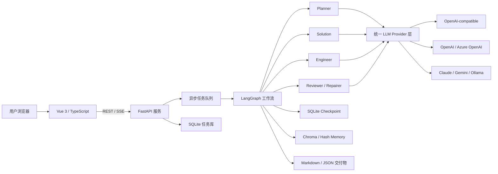

# 项目架构文档

## 1. 文档目的

本文说明多智能体需求交付系统的运行架构、模块边界、核心数据流和部署拓扑，适用于源码学习、功能二开、部署评估与交付验收。

## 2. 架构概览

系统采用前后端分离、工作流编排和本地持久化架构。Vue 负责业务操作与结果展示，FastAPI 提供任务接口和 SSE 进度流，LangGraph 管理多节点协作、条件路由与断点续跑，模型适配层屏蔽不同厂商接口差异。

## 3. 分层说明

| 层级 | 主要目录 | 职责 |
| --- | --- | --- |
| 表现层 | `frontend-vue/src` | 仪表盘、任务创建、历史任务、任务详情、人工反馈和结果展示 |
| 接口层 | `app/api` | REST API、SSE 事件流、参数校验和错误响应 |
| 应用层 | `app/core` | 配置、模型工厂、后台任务、日志和可观测指标 |
| 工作流层 | `app/graph`、`app/agents` | 节点编排、状态传递、条件分支、评审回流和人工审批 |
| 领域模型层 | `app/schemas` | 需求、PRD、技术设计和评审结果的结构化模型 |
| 基础设施层 | `app/storage`、`app/tools` | SQLite、Checkpoint、Chroma、工具注册与文件导出 |

## 4. 核心运行链路

1. 前端提交需求，后端立即创建任务并返回八位任务 ID。
2. 后台 worker 从队列中取出任务，启动 LangGraph 工作流。
3. Planner 规范化并澄清需求；信息不足时进入人工澄清节点。
4. Solution 生成 PRD，Engineer 生成技术设计和代码骨架建议。
5. Reviewer 对完整性和覆盖率进行检查；未达标时进入修复或回流节点。
6. 人工审批通过后生成 Markdown、JSON 等交付文件。
7. 任务状态写入 SQLite，工作流检查点单独持久化，前端通过轮询与 SSE 展示进度。

## 5. 数据与状态

- `tasks.db`：任务主记录、状态快照、结果和人工反馈。
- `langgraph_checkpoints.sqlite`：工作流节点状态，用于人工中断后恢复。
- `data/chroma`：启用记忆功能时保存案例与架构模式向量。
- `output/{task_id}`：每个任务的最终交付文件。
- `.env`：模型密钥及运行参数，不进入发布包或版本库。

## 6. 部署拓扑

本地开发模式下，Vite 运行在 `5173`，并将 `/api` 代理至 FastAPI `8000`。Docker 模式下，Nginx 提供 Vue 静态页面并反向代理 `/api`，页面端口为 `8080`，FastAPI 对外端口仍为 `8000`。两种模式使用同一套业务代码和环境变量。

## 7. 扩展点

- 在 `app/core/llm.py` 增加新模型 provider。
- 在 `app/agents` 增加新角色，并在 `app/graph/builder.py` 注册节点和边。
- 在 `app/tools/registry.py` 注册新的工具能力。
- 在 `app/tools/export_tool.py` 增加 PDF、DOCX 或第三方平台导出。
- 将 SQLite repository 替换为 MySQL/PostgreSQL 实现，以支持更高并发部署。

