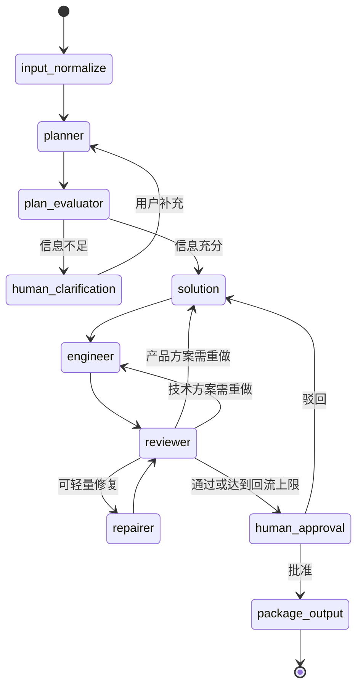

# 总体项目设计

## 1. 产品定位

本项目定位为“需求分析与技术交付工作流”的学习源码和二次开发基础。它将需求分析、产品方案、工程设计、质量评审和人工确认组合为可运行流程，不等同于无需复核即可上线的企业级自动开发平台。

## 2. 功能范围

### 2.1 核心功能

- 创建自然语言需求任务。
- 自动执行需求澄清、PRD 生成、技术设计和质量评审。
- 在关键信息不足时暂停并收集人工补充。
- 对评审未通过的结果进行修复或指定节点回流。
- 展示仪表盘、历史任务、实时进度和任务详情。
- 导出结构化需求、PRD、技术设计、评审报告及完整结果。
- 支持多种云端或本地大模型 provider。

### 2.2 当前不包含

- 用户注册、登录、角色权限和租户隔离。
- 在线支付、计费、模型额度管理。
- 多机分布式任务调度与高可用数据库。
- 自动部署生成项目或替代专业人员的最终验收。

## 3. 主要用例

| 参与者 | 用例 | 结果 |
| --- | --- | --- |
| 使用者 | 提交项目需求 | 创建任务并进入后台执行 |
| 使用者 | 补充澄清信息 | 从 Checkpoint 恢复流程 |
| 使用者 | 审批或驳回结果 | 导出交付物或回流重做 |
| 使用者 | 浏览历史任务 | 查看状态、标题、时间和详情 |
| 二开人员 | 切换模型服务 | 修改 `.env`，无需改 Agent 业务代码 |
| 二开人员 | 增加 Agent/工具 | 扩展节点、路由、Schema 和工具注册 |

## 4. 工作流设计

实验性的 Dialogue 模式可在评审失败后并行询问 Solution 与 Engineer，再回到 Reviewer 复评；默认关闭，以减少首次运行成本和模型能力要求。

## 5. 状态设计

`AgentState` 是节点间唯一共享上下文，主要分为：

- 输入：原始需求、规范化需求。
- 业务产物：澄清结果、PRD、技术设计、代码骨架、评审结果。
- 人工交互：澄清标记、反馈、审批结果。
- 流程控制：当前节点、下一动作、回流次数、错误信息。
- 上下文增强：任务短期记忆、对话记录、检索结果和指标。

字段使用 reducer 明确覆盖或追加策略，便于后续插入节点、并行分支和扩展状态。

## 6. 数据模型

任务表保存任务 ID、用户输入、状态、当前节点、状态快照、最终结果、回流次数和时间。反馈表按任务记录澄清或审批内容。工作流 Checkpoint 使用独立 SQLite 文件保存 LangGraph 内部状态，避免任务业务表与框架状态强耦合。

任务主要状态包括：`created`、`queued`、`running`、`waiting_human`、`completed` 和 `error`。

## 7. 接口设计原则

- 路径以 `/tasks` 为核心资源。
- 创建任务快速返回，耗时操作转入后台。
- 查询接口返回任务快照，结果接口返回最终交付数据。
- 人工反馈接口只接受处于 `waiting_human` 的任务。
- SSE 为增强通道；即使客户端断线，仍可通过查询接口恢复页面状态。

FastAPI 自动接口文档位于 `http://127.0.0.1:8000/docs`。

## 8. 异常与恢复

- 配置错误在首次创建模型时返回明确的 provider/环境变量提示。
- 模型服务异常由 SDK 重试，最终异常写入任务状态和日志。
- 远程 embedding 不可用时自动降级为本地 Hash 向量。
- SSE 断开不终止后台任务。
- 人工中断依赖持久化 Checkpoint 恢复；缺少 Checkpoint 时反馈接口拒绝恢复，避免状态错乱。

## 9. 二次开发建议

先保持状态模型和 API 契约稳定，再替换基础设施。常见演进顺序为：增加鉴权与用户体系、接入 PostgreSQL、引入 Redis 任务队列、增加对象存储、补充运营后台，最后再做多实例和监控体系。

